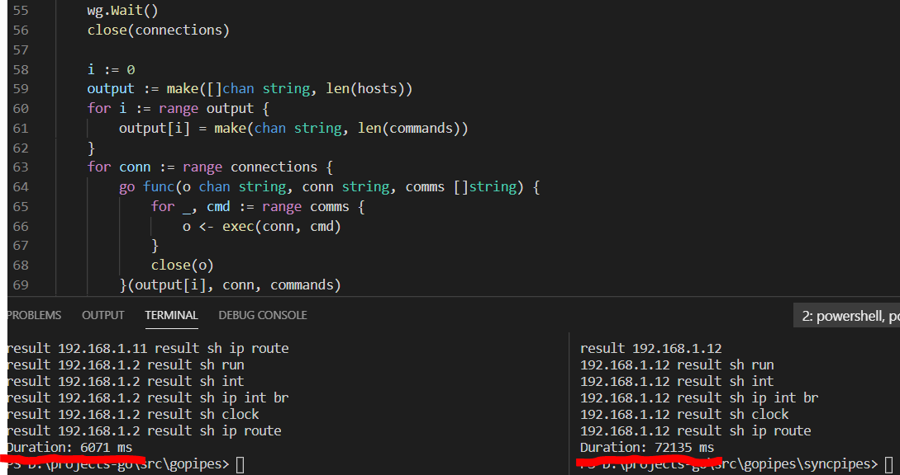

# gopipes
Emulates executing multiple commands on multiple devices. The sequence of connections to the devices is random. Commands are executed one after the other in goroutines. The duration of connecting and executing each command is 1 second for testing.

For comparison, the "syncpipes" folder contains the synchronous version.

The screenshot shows a comparison of asynchronous execution with synchronous execution for 12 devices and 5 commands. In fact, these conditions do not matter for execution in goroutines. While the operating time is predictably growing for serial connection and execution of commands, then in asynchronous mode and on hundreds of devices everything is performed in a matter of seconds.

